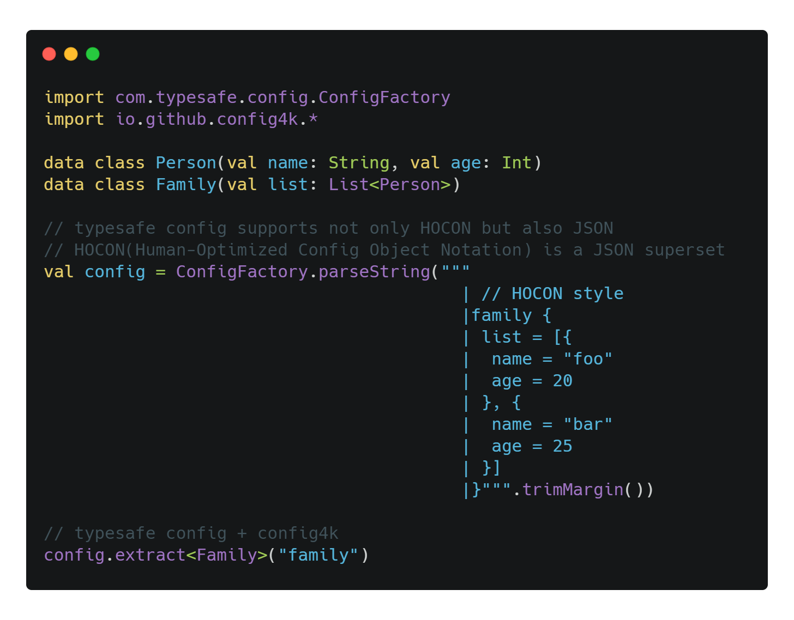

_**Config** for **K**otlin._

**Config4k** is a lightweight [Typesafe Config](https://github.com/typesafehub/config) wrapper for Kotlin and inspired by [ficus](https://github.com/iheartradio/ficus),  providing simple extension functions `Config.extract<T>` and `Any.toConfig` to convert between `Config` and Kotlin Objects.

